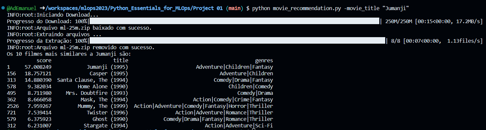
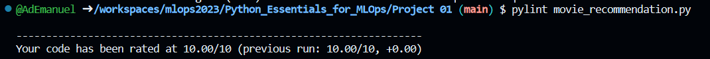
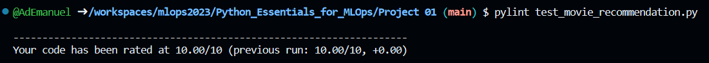
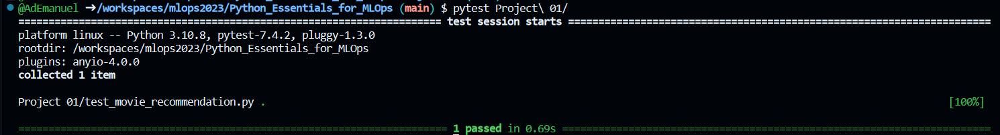

# Sistema de Recomendação de Filmes em Python

## Descrição

O projeto fornece ao usuário recomendações de filmes semelhantes com base no título de um filme de sua escolha. Utilizando técnicas de processamento de texto e análise de classificações de usuários, o sistema calcula a similaridade entre o título consultado e os títulos de filmes em um conjunto de dados disponível em [GropLens Datasets](http://files.grouplens.org/datasets/movielens/ml-25m.zip) para identificar os 10 filmes mais relevantes e sugerir opções de entretenimento compatíveis com o gosto do usuário.

## Instalação e Execução

Para instalar e executar o código a partir do repositório GitHub siga os passos abaixo: 

1. Clone o repositório:

```bssh
git clone https://github.com/AdEmanuel/mlops2023.git
```

2. Navegue até a pasta do projeto:

```bash
cd mlops/Python_Essentials_for_MLOps/Project\ 01
```

3. Instale as dependências usando o pip:

```bash
pip install -r requirements.txt
```

4. Execute o código da função principal:

```bash
python movie_recommendation.py -movie_title "Título do Filme"
```

Um exemplo de execução do programa pode ser visto a seguir: 



## Aplicação de Ferramentas

# Pontuação de qualidade atribuída pelo Pylint

- movie_recommendation.py



- test_movie_recommendation.py



# Saída dos testes do Pytest


